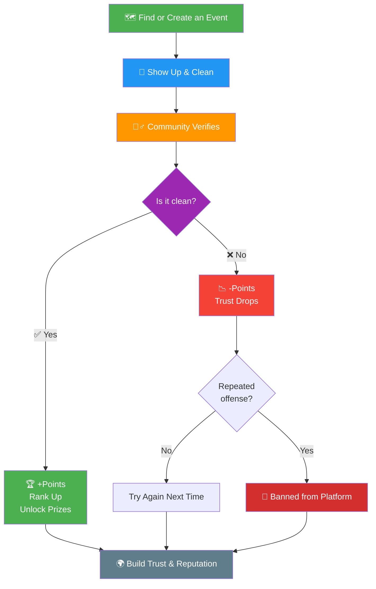

# 🧹 SweepTogether

**Clean. Verify. Earn. Together. 🌍**

A community platform where you organize cleanups, join events, and get verified by others. No cheating — just real impact. Earn points, build trust, and unlock rewards. 🌱🏆

## ❓ How It Works

### 1. 🗺️ Find or Create an Event

Browse upcoming cleanups near you — streets, rivers, beaches, parks, neighborhoods.  
No event nearby? Create one. Be the spark.

> Volunteering is never an obligation. Choose what fits you. If you ever feel uncomfortable with an organizer, stay away — your safety comes first. ✅🛡️

---

### 2. 🧹 Show Up & Clean

Join the team. Sweep together. Make the place spotless.  
Take photos. Log your work. Every piece of trash removed = progress.

---

### 3. 🕵️‍♂️ Get Verified (The Trust Layer)

Here's what makes us different:

Random people near the event (or other volunteers) verify if the street is *truly* clean.  
No faking. No cheating. **Real proof, real impact.**

> Verification is done by the community, for the community.

---

### 4. 🏆 Earn Points & Rank Up

| Your Action | What You Get |
|-------------|--------------|
| ✅ Verified cleanup | **+Points** — climb the global leaderboard |
| ❌ Failed verification (area still dirty) | **-Points** — trust goes down |
| 🔁 Repeated unfair behavior | **Banned** — integrity matters here |

The higher your rank, the **better the prizes** you unlock later. 🎁

---

### 5. 🌍 Build Trust. Earn Respect.

Your **trust score** is your reputation.  
High trust = you're a verified, reliable cleaner.  
Low trust = people will hesitate to join your events.

> We're not just cleaning streets — we're building a community of trusted, active citizens.

## 〽️ Flow Diagram



## ✨ Stack

- ⚡ **FastAPI** backend with async support
- 🔄 **HTMX** for dynamic interactions without writing JavaScript
- 🎨 **Tailwind CSS** for utility-first styling
- 📝 **Jinja2** templates with partials/layout system
- 🗄️ **SQLModel** (SQLAlchemy + Pydantic) ORM
- 🔐 **Session-based authentication** with password hashing
- 🧪 **Pytest** test setup with httpx async client
- 🐳 **Docker** ready

## 🚀 Quick Start

```bash
# Clone
git clone https://github.com/omarhossdev/sweep-together.git
cd sweep-together

#=================
# UV (Recommended)
#=================
# Install dependencies
uv sync

# Run for development
uv run uvicorn app.main:app --reload --port 8000

#=======================
# OR use pip
pip install -r requirements.txt
# Run 
uvicorn app.main:app --reload --port 8000
```

Visit [http://localhost:8000](http://localhost:8000)

## 📁 Project Structure

```
├── app/
│   ├── main.py              # FastAPI app entry point
│   ├── config.py            # Settings & configuration
│   ├── database.py          # Database setup (SQLite default)
│   ├── auth.py              # Authentication helpers
│   ├── models/
│   │   ├── user.py          # User model
│   │   └── todo.py          # Todo model (example CRUD)
│   ├── routers/
│   │   ├── pages.py         # Page routes (HTML responses)
│   │   ├── auth.py          # Auth routes (login/register/logout)
│   │   └── todos.py         # Todo HTMX endpoints
│   ├── templates/
│   │   ├── base.html        # Base layout
│   │   ├── index.html       # Home page
│   │   ├── login.html       # Login page
│   │   ├── register.html    # Register page
│   │   ├── dashboard.html   # Dashboard with todo app
│   │   └── partials/
│   │       ├── todo_item.html
│   │       ├── todo_list.html
│   │       ├── todo_edit.html
│   │       └── flash.html
│   └── static/
│       ├── css/
│       │   └── app.css      # Tailwind + custom styles
│       └── js/
│           └── app.js       # Minimal JS (HTMX config)
├── tests/
│   ├── conftest.py
│   └── test_todos.py
├── requirements.txt
├── Dockerfile
├── docker-compose.yml
├── tailwind.config.js
├── pyproject.toml
└── .env.example
```

## ⚖️ License

MIT License — see [LICENSE](LICENSE)
